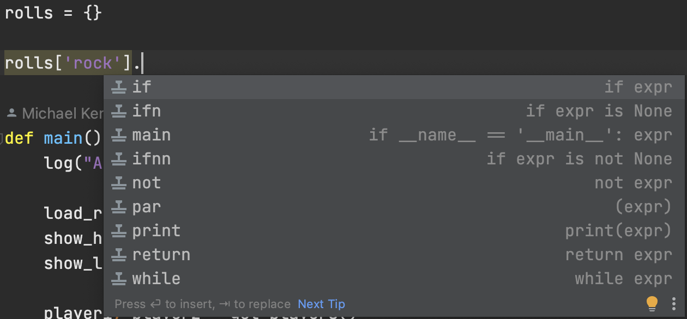
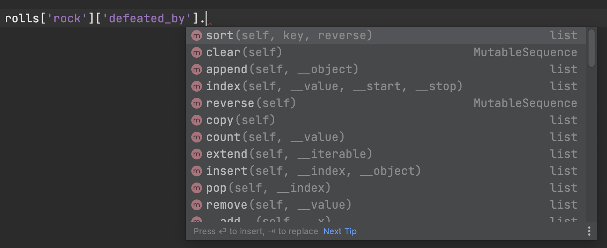

# Python Typing Exercises

In this exercise, you'll take a simple **[7-way rock paper scissors](http://retrohelix.com/en/wp-content/uploads/2013/08/rps7.jpg)** game which was written without types. You'll see that the editor cannot help you with writing code or errors when it does not know the types.

## Steps

* Open the folder `rocks-game` and open `rpsgame.py`.
* Go through each **variable**, **function parameter**, and **function return value**. 
  * See if your editor can understand what they are or detect errors (for example, return a string where a number is expected or visa versa). 

You will need to use nested types for certain containers, such as:

```python
thing: dict[str, list[str]]
```

(that's not an actual example, but something to use as a hint, it's a dictionary like `{"key": ["val1", "val2"] }`)

## Solutions

The solution (*a solution*) is in the `./solution` folder.

## Motivation

Here are some examples of the benefits:

Catching **invalid return types**:


**No autocomplete**:



Now **with autocomplete**:


